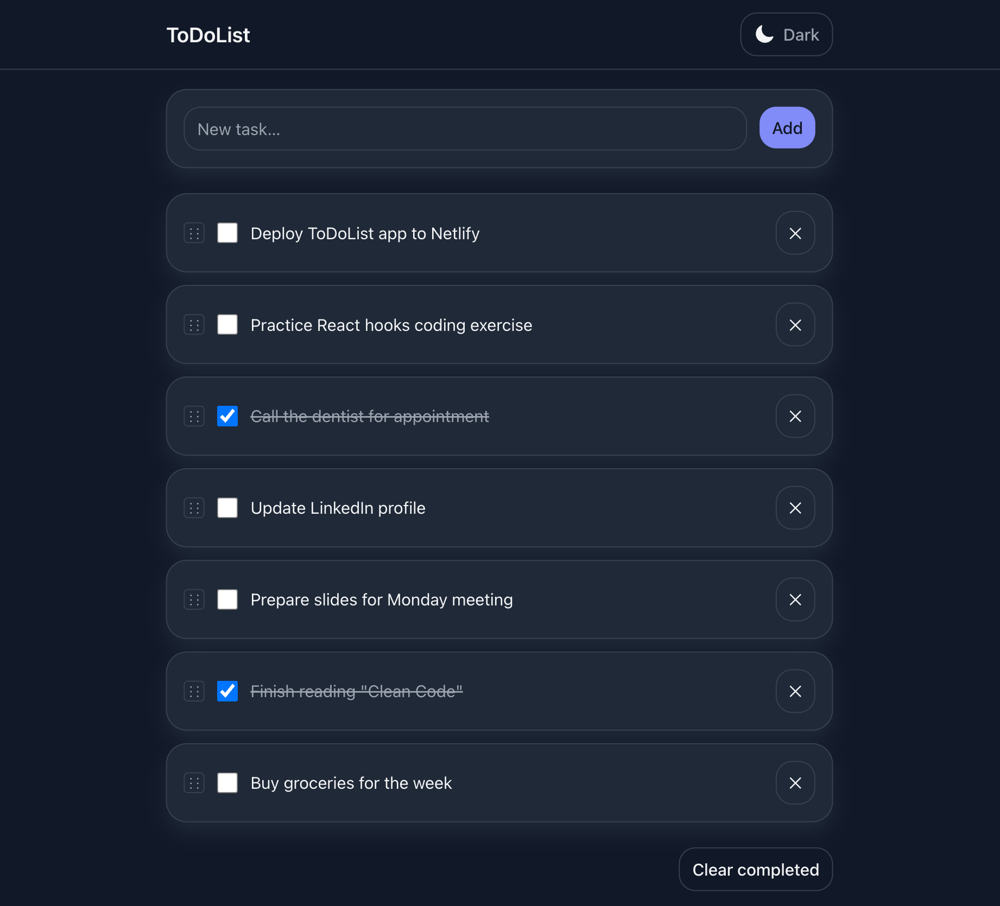

# ToDoList App

A clean, minimal task manager focused on speed and clarity. Add, complete, and organize tasks with a lightweight UI and instant feedback.

## Tech Stack


## Live Demo

https://nstefanchuk-todolistapp.netlify.app/

## Features

- Add, complete, and delete tasks
- Persist tasks with Local Storage
- Clear completed in one click
- Filter by All / Active / Completed
- Keyboard-friendly input and actions
- Responsive layout

## Screenshots

<p align="center">
  
</p>

## Getting Started

```bash
git clone https://github.com/NStefanchuk/ToDoList-App.git
cd ToDoList-App
npm install
npm run dev
```
